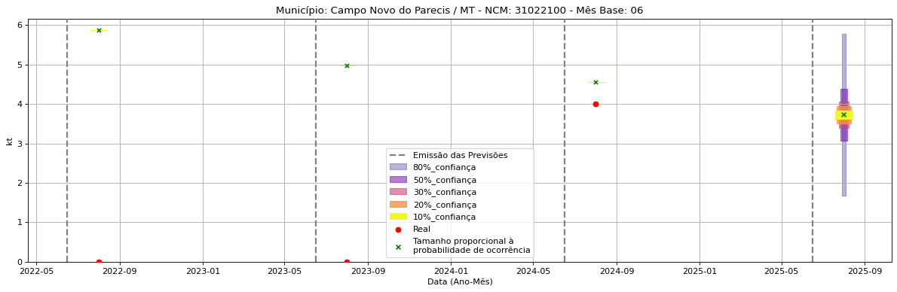
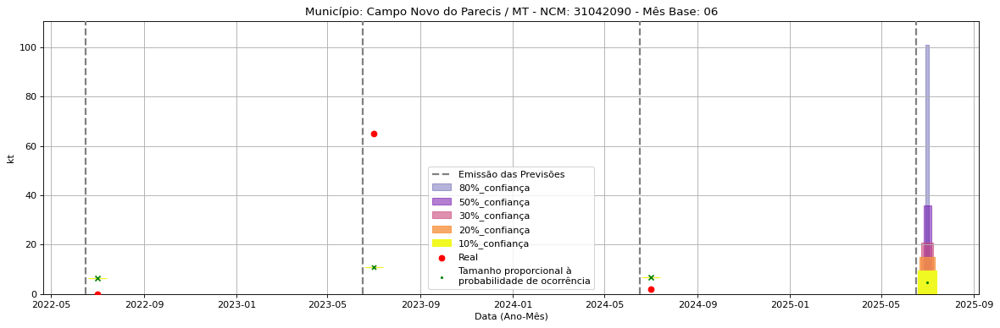

<header>
    <h1><a href="https://quantimportbrazil.github.io/Sobre/">QuantImport</a></h1>
</header>

---

# Previsão de Importação - Campo Novo do Parecis-MT

> **Emissão:** 06-2025
> Para fins de comparação, também apresentamos a seguir previsões e valores reais de períodos anteriores ao atual.
> As previsões foram geradas com base em dados limitados até o mês 6.

---

**[Home](https://quantimportbrazil.github.io/Sobre/)** | **[Selecionar Estado (UF)](https://quantimportbrazil.github.io/Unidades_Federativas/)**

Fator de Influência em Destaque:
Previsão Influenciada:
- Município: Campo Novo do Parecis
- Produto (NCM): Sulfato de amônio-31022100 
- Mês previsto: 12

Fator Influenciador: Comex
- Município: Blumenau
- Grupo de Produto (SH2): Adubos (fertilizantes)-31 
- Mês previsto: 12
- Unidade: price_mun_lag25

Fator de Influência em Destaque:
Previsão Influenciada:
- Município: Campo Novo do Parecis
- Produto (NCM): Outros cloretos de potássio-31042090 
- Mês previsto: 05

Fator Influenciador: Comex
- Município: Cuiabá
- Grupo de Produto (SH2): Sementes e frutos oleaginosos; grãos, sementes e frutos diversos; plantas industriais ou medicinais; palhas e forragens-12 
- Mês previsto: 05
- Unidade: kt_lag12

